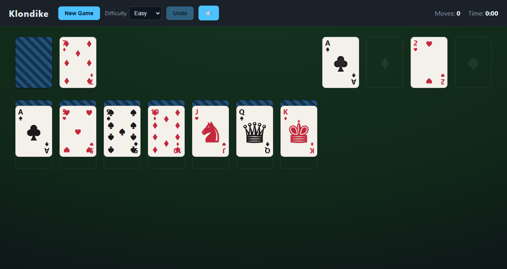

# Klondike Solitaire

A dark-themed, browser-based Klondike Solitaire you play locally — no install, no
server, no internet. One-card draw, unlimited undo, and four difficulty levels.



## Play

Just open **`index.html`** in any modern desktop browser (double-click it).
That's it — the whole game runs from the local files over `file://`.

> Optional: for a clean preview over HTTP run `npm run serve` (uses Python's
> built-in server) and visit <http://localhost:8000>.

## Controls

- **Draw:** click the **stock** (top-left) to flip one card to the waste. When
  the stock is empty, click it again (the **↻**) to recycle the waste —
  unlimited recycles.
- **Move a card:** either
  - **click** a card/run to select it, then **click** a destination, or
  - **drag and drop** it onto a destination.
- **Auto to foundation:** **double-click** a card to send it to its foundation
  if the move is legal.
- **Foundation → tableau:** you can drag (or click-move) a card back down from a
  foundation onto the tableau, per the rules, for more advanced play.
- **Auto-Collect:** once every card is known (the stock is empty and no tableau
  cards are face-down), an **Auto-Collect** button appears next to Undo. Click it
  to watch the remaining cards fly to the foundations one by one, in rank order,
  each with its collect sound — it does not skip straight to the win screen.
- **Undo:** click **Undo** (or press **Ctrl/Cmd+Z**). Unlimited within a match.
- **New Game / Difficulty:** pick a level and press **New Game**. Changing the
  difficulty applies on the next New Game.
- **Sound:** toggle the 🔊 / 🔇 button. Effects (card flick, place, foundation
  chime) are synthesized in-browser via the Web Audio API — no audio files.

Number cards show standard pip layouts; court cards use suit-colored chess
glyphs (J = ♞, Q = ♛, K = ♚). Cards animate when moving, flipping, and being
collected (snappy ~160ms); this respects your `prefers-reduced-motion` setting.

Standard Klondike rules: build the four foundations up A→K by suit; build tableau
columns down in alternating colors; only Kings go on empty columns. Win by moving
all 52 cards to the foundations.

## Difficulty

Difficulty does not change the rules — it changes **which deal you get**. Deals
are pre-classified by a difficulty **heuristic** (how deeply low cards are buried,
color clustering, opening mobility, aces stuck in the stock). The four levels —
**easy / hard / expert / master** — draw from progressively harder buckets in a
bundled deal pool (`src/deals.js`).

This is a heuristic estimate, not a solver guarantee: easy deals are
statistically easier, not provably winnable. See [`SCOPE.md`](./SCOPE.md) §4.

## Project layout

```
index.html            # page shell (loads scripts in order; no modules, so file:// works)
styles.css            # dark theme + card visuals
src/
  namespace.js        # window.Solitaire global
  engine.js           # pure rules engine (no DOM) — also runs under Node for tests
  heuristic.js        # deal difficulty scoring (shared by game + generator)
  deals.js            # GENERATED pre-classified deal pool
  sound.js            # synthesized Web Audio effects (flip/pick/move/collect)
  render.js           # state -> DOM (pip layouts + chess court cards)
  interactions.js     # click / drag / double-click handlers
  app.js              # controller: state, undo history, timer, auto-collect, wiring
tools/generate-deals.mjs  # offline Node script that writes src/deals.js
test/                 # Node unit tests (engine + heuristic)
```

## Development

Requires Node.js (used only for tests and regenerating deals — not for playing).
There are **no third-party dependencies**; tests use Node's built-in test runner.

```bash
npm test       # run engine + heuristic unit tests
npm run gen    # regenerate src/deals.js (deterministic, seeded)
npm run serve  # serve over http://localhost:8000
```

`src/deals.js` is generated but **committed** so the game works immediately on
clone. CI (`.github/workflows/ci.yml`) runs the tests and verifies `deals.js` is
up to date with the generator.

## Reproducibility

Clone and play — no build step. To regenerate the deal pool from scratch,
`npm run gen` produces byte-for-byte identical output (seeded RNG, no
timestamps), which is what CI checks.

## License

MIT.
