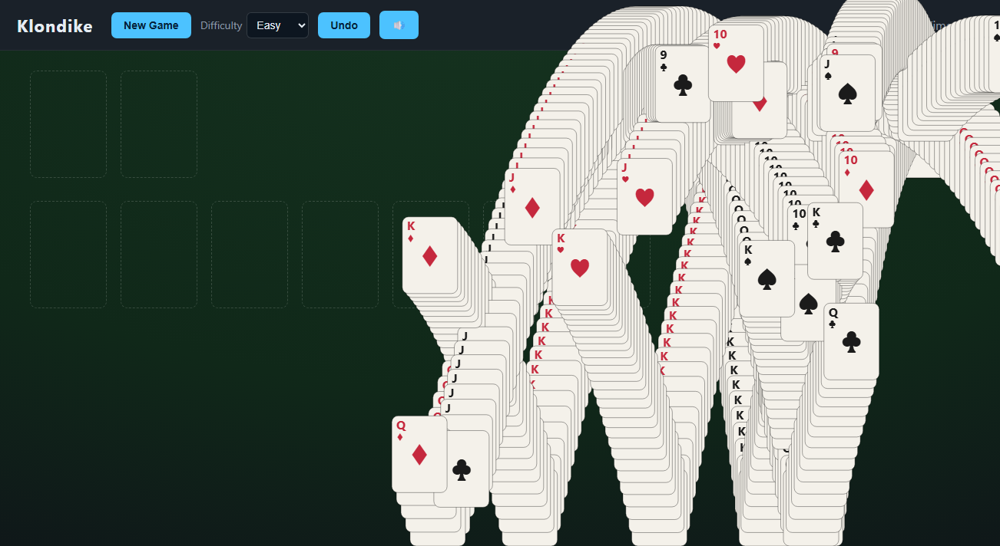

# Klondike Solitaire

#### I created this vibe coding project simply because I don't want to watch the ads every time before playing the Solidaire that comes pre-installed with Microsoft systems!

A dark-themed, browser-based Klondike Solitaire you play locally — no install, no
server, no internet. One-card draw, unlimited undo, and four difficulty levels.


## Play

Just open **`index.html`** in any modern desktop browser (double-click it).
That's it — the whole game runs from the local files over `file://`.

> Optional: for a clean preview over HTTP run `npm run serve` (uses Python's
> built-in server) and visit <http://localhost:8000>.

## Controls

- **Draw:** click the **stock** (top-left) to flip one card to the waste. When
  the stock is empty, click it again (the **↻**) to recycle the waste —
  unlimited recycles.
- **Move a card:** either
  - **click** a card/run to select it, then **click** a destination, or
  - **drag and drop** it onto a destination.
- **Auto to foundation:** **double-click** a card to send it to its foundation
  if the move is legal.
- **Foundation → tableau:** you can drag (or click-move) a card back down from a
  foundation onto the tableau, per the rules, for more advanced play.
- **Auto-Collect:** once every card is known (the stock is empty and no tableau
  cards are face-down), an **Auto-Collect** button appears next to Undo. Click it
  to watch the remaining cards fly to the foundations one by one, in rank order,
  each with its collect sound — it does not skip straight to the win screen.
- **Hint:** click **Hint** (limited to 3 per game) to highlight a good move. The
  built-in solver knows the full deal, so the hint is the first move of an actual
  winning line from your current position — no matter how you got there. If the
  position can no longer be won, it falls back to suggesting a stock draw.
- **Undo:** click **Undo** (or press **Ctrl/Cmd+Z**). Unlimited within a match.
- **New Game / Difficulty:** pick a level and press **New Game**. Changing the
  difficulty applies on the next New Game.
- **Restart:** press **Restart** to replay the *same* deal from the opening
  layout — handy when you dead-end and want another attempt at the hand you had.
- **Sound:** toggle the 🔊 / 🔇 button. Effects (card flick, place, foundation
  chime) are synthesized in-browser via the Web Audio API — no audio files.

Number cards show standard pip layouts; court cards use suit-colored chess
glyphs (J = ♞, Q = ♛, K = ♚). Cards animate when moving, flipping, and being
collected (snappy ~160ms); this respects your `prefers-reduced-motion` setting.

When you win, a classic bouncing-card cascade paints the screen before the stats
appear — click anywhere to skip it.



Standard Klondike rules: build the four foundations up A→K by suit; build tableau
columns down in alternating colors; only Kings go on empty columns. Win by moving
all 52 cards to the foundations.

## Difficulty

Difficulty does not change the rules — it changes **which deal you get**. Every
bundled deal is **solver-verified winnable** (`src/solver.js` wins it before it
is added to the pool), so no game starts in an unwinnable position.

The four levels — **easy / hard / expert / master** — are graded by the
**win rate of an imperfect auto-player** (`tools/casual-player.mjs`): it plays
each deal many times, and the fraction it wins is the difficulty signal. This
tracks *felt* difficulty. Two profiles are used so the hard end stays sharp: a
**casual** player (frequent mistakes) splits easy vs hard, while a **skilled**
player (near-optimal) splits expert vs master — a **master** deal is one even a
skilled player wins under 5% of the time, yet the solver proves it *is* winnable
with precise play. Deals are placed by absolute win-rate thresholds (not
quartiles), oversampling the rare hard tail. (This replaced an earlier "solver
search effort" metric, which couldn't tell easy and expert apart — see
[`SCOPE.md`](./SCOPE.md) §4.)

## Project layout

```
index.html            # page shell (loads scripts in order; no modules, so file:// works)
styles.css            # dark theme + card visuals
src/
  namespace.js        # window.Solitaire global
  engine.js           # pure rules engine (no DOM) — also runs under Node for tests
  heuristic.js        # deal difficulty scoring (legacy estimate; kept for reference)
  solver.js           # Klondike solver — winnability check (Node) + live Hint (browser)
  deals.js            # GENERATED solver-verified-winnable deal pool
  sound.js            # synthesized Web Audio effects (flip/pick/move/collect)
  render.js           # state -> DOM (pip layouts + chess court cards)
  interactions.js     # click / drag / double-click handlers
  app.js              # controller: state, undo history, timer, hint, auto-collect, wiring
tools/casual-player.mjs   # imperfect auto-player; win rate = difficulty signal
tools/generate-deals.mjs  # offline Node script that writes src/deals.js
tools/verify-deals.mjs    # re-solves the committed pool (CI winnability check)
test/                 # Node unit tests (engine + heuristic + solver + casual-player)
```

## Development

Requires Node.js (used only for tests and regenerating deals — not for playing).
There are **no third-party dependencies**; tests use Node's built-in test runner.

```bash
npm test       # run engine + heuristic + solver unit tests
npm run gen    # regenerate src/deals.js (deterministic; runs the solver — minutes)
npm run serve  # serve over http://localhost:8000
```

`src/deals.js` is generated but **committed** so the game works immediately on
clone. CI (`.github/workflows/ci.yml`) runs the tests and `npm run verify`,
which re-solves every bundled deal to prove it is winnable.

## Reproducibility

Clone and play — no build step. `npm run gen` regenerates the deal pool from
scratch (seeded RNG + a deterministic solver, so the output is byte-for-byte
identical on any platform); it takes a few minutes because it solves each
candidate. `npm run verify` is the fast check CI uses — it re-solves only the
committed pool.

## License

MIT.
